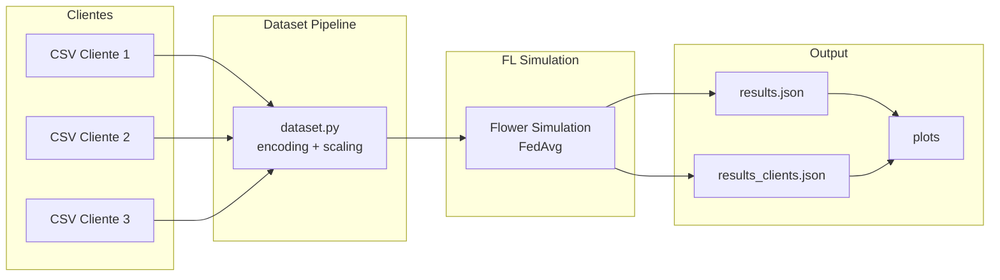
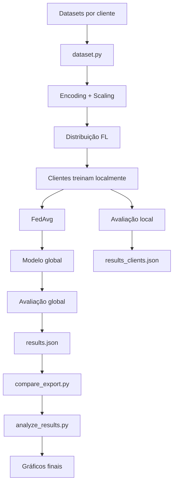

# Federated Learning com Datasets Independentes por Cliente

Este projeto implementa um pipeline completo de **Aprendizado Federado (Federated Learning)** utilizando o framework Flower, com suporte a:

- Um dataset exclusivo por cliente
- Dados heterogêneos (não-IID)
- Avaliação global e local
- Comparação entre cenários clean vs poisoned
- Geração de métricas e gráficos

O foco é a análise do impacto de dados comprometidos (e.g., label poisoning) em cenários federados.

---

# 📌 Visão Geral

Diferente da abordagem [original](https://github.com/maxwelmms/ufu_tcc_esp_seguranca_cibernetica) (um dataset dividido entre clientes), este projeto assume:

👉 **Cada cliente possui seu próprio dataset independente**

Isso permite simular cenários reais onde:
- dados são naturalmente distribuídos
- cada cliente tem distribuição diferente
- alguns clientes podem estar comprometidos (poisoned)

Download do dataset [Aqui](https://github.com/sequincozes/CounselorNode/tree/main/data_sbrc2026)

---

# 🧠 Conceito Central

## Federated Learning (FL)

Treinamento distribuído onde:
- cada cliente treina localmente
- o servidor agrega os modelos (FedAvg)
- os dados nunca saem do cliente

---

## Não-IID (Heterogeneidade)

Os dados entre clientes podem ser:
- desbalanceados
- com classes diferentes
- com distribuições distintas

👉 Neste projeto, isso é natural (cada CSV já é diferente)

---

## Poisoning

Neste novo modelo:

❌ O código NÃO aplica poisoning  
✅ O poisoning é feito previamente no dataset

Ou seja:

| Cliente | Dataset |
|--------|--------|
| C1 | clean |
| C2 | clean |
| C3 | poisoned |

---

# 🏗️ Arquitetura



# 📁 Estrutura do Projeto
```
fed_conselhos/
│
├── src/
│   ├── analyze.py              # Pipeline principal (simulação FL)
│   ├── dataset.py              # Pipeline de dados (core)
│   ├── model.py                # Modelo ML (SGDClassifier)
│   ├── plot_clients.py         # Gráficos por cliente
│   ├── compare_export.py       # Comparação clean vs poisoned
│   ├── analyze_results.py      # Gráficos comparativos
│
├── data/
│   ├── treino_no1.csv
│   ├── no2.csv
│   ├── no3.csv
│   ├── teste_no1.csv (opcional)
│
├── runs/
│   └── <run-id>/
│       ├── results.json
│       ├── results_clients.json
│       ├── plots/
│
└── README.md
```

# ⚙️ Pipeline de Dados

Etapas:
1. Carregamento dos CSVs (1 por cliente)
2. Alinhamento de features (one-hot encoding global)
3. Codificação de labels global
4. Separação treino/teste (ou uso de dataset global)
5. Normalização (StandardScaler global)
6. Distribuição para clientes


# Modos de Avaliação
🔹 Modo 1 — Split Local
```bash
--local-eval-source split
```

Cada cliente:

- treina em parte do seu dataset
- testa em outra parte do seu dataset

🔹 Modo 2 — Avaliação Global

```bash
--local-eval-source global
--eval-csv data/teste_no1.csv
```

Cada cliente:

- treina em TODO seu dataset
- testa no mesmo dataset global

👉 Ideal para comparação justa entre clientes


# 🚀 Execução
Execução básica:

```bash
python src/analyze.py \
  --client-csvs data/treino_no1.csv,data/no2.csv,data/no3.csv \
  --rounds 15 \
  --fraction-fit 1.0 \
  --local-eval-size 0.2 \
  --local-epochs 1 \
  --seed 42 \
  --run-id exp1
```

Execução com avaliação global:

```bash
python src/analyze.py \
  --client-csvs data/treino_no1.csv,data/no2.csv,data/no3.csv \
  --eval-csv data/teste_global.csv \
  --local-eval-source global \
  --rounds 15 \
  --fraction-fit 1.0 \
  --local-epochs 1 \
  --seed 42 \
  --run-id exp1_global
```

Execução com treino local mais forte (recomendado):

```bash
python src/analyze.py \
  --client-csvs data/no1_train.csv,data/no2_train.csv,data/no3_train.csv \
  --eval-csv data/test.csv \
  --local-eval-source global \
  --rounds 50 \
  --fraction-fit 1.0 \
  --local-epochs 3 \
  --client-num-cpus 1 \
  --ray-init-num-cpus 4 \
  --seed 42 \
  --run-id exp1_strong
```

Execução mais realista (clientes parciais por round):

```bash
python src/analyze.py \
  --client-csvs data/no1_train.csv,data/no2_train.csv,data/no3_train.csv \
  --eval-csv data/test.csv \
  --local-eval-source global \
  --rounds 50 \
  --fraction-fit 0.66 \
  --local-epochs 3 \
  --client-num-cpus 1 \
  --ray-init-num-cpus 4 \
  --seed 42 \
  --run-id exp1_partial
```

# 

# 📊 Saídas
`results.json`

Métricas globais por round:

```
{
  "by_round": [
    {"round": 1, "accuracy": 0.85, "f1": 0.82},
    ...
  ]
}
```

`results_clients.json`

Métricas por cliente:

```
{
  "clients": {
    "0": [{"round": 1, "accuracy": 0.80}],
    "1": [{"round": 1, "accuracy": 0.90}]
  }
}
```


# 📈 Geração de Gráficos

Por cliente:

```
python src/plot_clients.py \
  --in runs/exp1/results_clients.json \
  --outdir runs/exp1/plots
```

Gera:

- heatmap cliente vs round
- curva média
- barras finais

# Comparação Clean vs Poisoned
1. Exportar comparação:

```
python src/compare_export.py \
  --clean runs/clean/results.json \
  --poison runs/poison/results.json \
  --out-csv runs/compare.csv \
  --out-summary runs/summary.json
```

2. Gerar gráficos:

```
python src/analyze_results.py \
  --csv runs/compare.csv \
  --outdir runs/compare_plots
```

# 📉 Métricas
- Accuracy
- Precision (weighted)
- Recall (weighted)
- F1-score (weighted)


Delta (diferença):

$$
\Delta = M_{clean} - M_{poison}
$$

- Δ > 0 → clean melhor
- Δ < 0 → poisoned melhor

# 🔁 Fluxo Completo


## 🧪 Cenários Experimentais

Você pode testar:

| Cenário   | Descrição                                      |
|----------|-----------------------------------------------|
| Clean    | todos datasets limpos                         |
| Poisoned | alguns clientes com dados alterados           |
| Mixed    | combinação de ambos                           |

---

## ⚠️ Recomendações

- Use mesmo espaço de features entre datasets  
- Garanta consistência da coluna target ("class")
- Use dataset global para comparação (justa)  
- Controle seeds para reprodutibilidade  

---

## 🧩 Modelo

```
SGDClassifier(loss="log_loss")
```

Motivos:

- suporta incremental learning
- leve e rápido
- compatível com FL


# 📌 Resumo Final

Este projeto permite:

- ✅ Simular FL realista
- ✅ Usar datasets independentes por cliente
- ✅ Avaliar impacto de dados comprometidos
- ✅ Comparar cenários clean vs poisoned
- ✅ Gerar métricas e gráficos


# 📚 Possíveis Extensões
- robust aggregation (Krum, Median)
- detecção de clientes maliciosos
- client weighting
- auditoria avançada

---


> **Autor:** Maxwel Martins da Silva
> **Descrição:** Projeto de Federated Learning aplicado à segurança cibernética.
> **Python version:** 3.11.9
> **Sistema Operacional:** MS Windows 11
> **Frameworks:** Flower 1.20, Ray, Scikit-Learn, Pandas, Matplotlib
> **Licença:** Livre para fins acadêmicos e educacionais (GPLv3).

```
